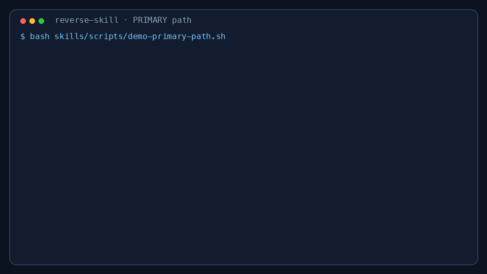
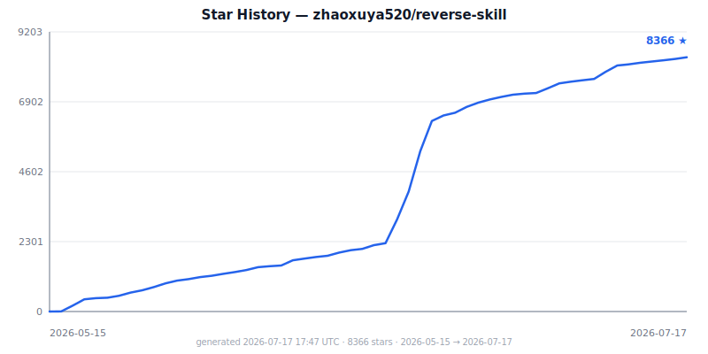

<p align="center">
  
</p>

<h1 align="center">reverse-skill</h1>
<h3 align="center">Reverse Engineering / Authorized Penetration Testing / Security Research Skill Router Pack</h3>

<p align="center"><em style="font-family: 'KaiTi', 'STKaiti', 'SimSun', serif; font-size: 1.3em; color: #999;">破暗而行，逆水为舟</em></p>

<p align="center">AI-powered routing + On-demand toolchain bootstrapping + Self-evolving knowledge base<br/>
逆向/渗透/安全技能路由包 — AI 自动路由 · 按需自举工具链 · 自动进化经验库</p>

<p align="center">
  <a href="https://github.com/zhaoxuya520/reverse-skill/releases/tag/v1.0.0"></a>
  <a href="https://github.com/zhaoxuya520/reverse-skill/stargazers"></a>
  <a href="https://github.com/zhaoxuya520/reverse-skill/forks"></a>
  <a href="https://github.com/zhaoxuya520/reverse-skill/issues"></a>
  <a href="LICENSE"></a>
  <a href="CHANGELOG.md"></a>
  <a href="https://skills.sh/zhaoxuya520/reverse-skill"></a>
</p>

<p align="center">
  <a href="https://trendshift.io/repositories/43969?utm_source=trendshift-badge&amp;utm_medium=badge&amp;utm_campaign=badge-trendshift-43969" target="_blank" rel="noopener noreferrer"></a>
</p>

<br/>

<p align="center">
  <a href="#关于项目">关于</a> ·
  <a href="#快速开始">快速开始</a> ·
  <a href="#使用说明">使用说明</a> ·
  <a href="skills/MASTER-ROUTING.md">快路径</a> ·
  <a href="skills/routing.md">路由矩阵</a> ·
  <a href="skills/ops/">作战契约</a> ·
  <a href="README_AI.md">AI 引导</a> ·
  <a href="#赞助">赞助</a> ·
  <a href="#贡献">贡献</a>
</p>

<p align="center">
  🌐 <a href="README.md">English</a>
</p>

<br/>

<a id="关于项目"></a>

## 关于项目

> **如果你是 AI Agent，直接跳转到 [README_AI.md](README_AI.md)，严格按照内容要求执行。**

当 AI Agent（Claude Code、Codex CLI、Cursor 等）遇到 APK、二进制、前端 JS 加密、CTF 或渗透测试任务时，这套系统能让它先路由到正确的方法论，再调用本机工具执行，而不是盲目猜命令。

```
用户任务
  → RULES.md
  → MASTER-ROUTING / master-route.ps1（PRIMARY）
  → case-init / scope.md（授权 + network_profile；未就绪禁止对目标 ACT）
  → 目标 Skill → 工具 / MCP / 脚本
  → timeline + Evidence→Finding→Path → 报告 + field-journal
```

**为什么需要这个项目：**
- AI Agent 面对 APK、ELF、JS、PCAP 不知道该用 jadx 还是 Frida 还是 IDA
- 工具路径、MCP 服务、脚本入口分散在不同机器，迁移困难
- 同样的问题每次重新踩坑，经验无法复用

PRIMARY 快路径：[skills/MASTER-ROUTING.md](skills/MASTER-ROUTING.md) · 全表：[skills/routing.md](skills/routing.md) · 作战契约：[skills/ops/](skills/ops/)

### 30 秒实证（真实脚本产物，不是摆拍）

一句话进 → 正确 PRIMARY skill + 可开工的 case 目录：

<p align="center">
  
</p>

```bash
bash skills/scripts/demo-primary-path.sh
bash skills/scripts/record-primary-path-demo.sh   # 重生成 GIF（Pillow；有 vhs 也可用）
# → examples/primary-path-demo/  + docs/assets/primary-path-demo.gif
```

| 现场样本 | PRIMARY |
|----------|---------|
| APK / jadx / 证书校验 | **R1** `apk-reverse` |
| JS 签名 / webpack | **R3** `js-reverse` |
| LLM Prompt 注入 | **R14** `llm-security` |
| radare2 ELF 侦察 | **R7** `radare2` |
| 本地离线 APK + case-guard | **ready_for_act=true** |

产物：[examples/primary-path-demo/RESULT-CARD.md](examples/primary-path-demo/RESULT-CARD.md) · [result-card.html](examples/primary-path-demo/result-card.html)

<br/>

<div align="center">
  <a href="https://star-history.com/#zhaoxuya520/reverse-skill&Date">
    
  </a>
</div>

<br/>

<p align="right">(<a href="#关于项目">返回顶部</a>)</p>

### 技术栈

<p align="left">
  <br/>
  <code>IDA Pro</code> · <code>radare2</code> · <code>Ghidra</code>
</p>

<p align="right">(<a href="#关于项目">返回顶部</a>)</p>

<a id="快速开始"></a>

## 快速开始

本轮打磨中文说明：[docs/LUBAN-POLISH-zh.md](docs/LUBAN-POLISH-zh.md)

### 前置依赖

- **Java / JDK** — 运行 jadx、apktool
- **Node.js 22.12+** — JS 工具链和 MCP 服务
- **Python 3.x** — Frida 和辅助脚本
- **代码 AI 客户端** — Claude Code、Codex CLI、Cursor 等

### 安装

**一行 Agent 安装**（把 skill 装进 Claude Code / Codex 等兼容客户端）：

```bash
npx skills add zhaoxuya520/reverse-skill
```

[skills.sh 目录页](https://skills.sh/zhaoxuya520/reverse-skill) · 只列不装：`npx skills add zhaoxuya520/reverse-skill -l`

**装完对 Agent 说（可直接复制）：**

```text
先读 README_AI.md 和 RULES.md。你是 reverse-skill 路由器：先 PRIMARY 路由 → 再 scope/授权门闩 → 再进专家 skill。空跑验证：bash skills/scripts/demo-primary-path.sh。真实授权离线 APK：bash skills/scripts/case-init.sh --hint "apk reverse" --preset offline-sample --sample ./app.apk。scope 未 ready_for_act=true 前禁止对任何在线目标 ACT。
```

**Claude Code plugin marketplace**（双通道；合入默认分支后可用）：

```text
/plugin marketplace add zhaoxuya520/reverse-skill
```

清单：[`.claude-plugin/marketplace.json`](.claude-plugin/marketplace.json)（路由器包入口——不是“800 个微 skill”）。

**完整工具链仍需 clone。** `npx skills add` 主要装 Agent skill 文件；脚本（`master-route` / `case-init` / `bootstrap` / tool-index）、Kali 辅助、本地 `work/` 案例在 git 树里：

```bash
git clone https://github.com/zhaoxuya520/reverse-skill.git
cd reverse-skill
```

### 初次使用

> **装完后优先让 AI 读 [README_AI.md](README_AI.md) 与 [RULES.md](RULES.md)，再按上面的“装完第一句话”开工。**

各平台详细部署文档：
- **Kali Linux** → [kali/README-kali.md](kali/README-kali.md)
- **Ubuntu/Debian** → [docs/platforms/linux.md](docs/platforms/linux.md)
- **macOS** → [docs/platforms/macos.md](docs/platforms/macos.md)

PRIMARY 路径（路由 → case scope → smoke）：

| 平台 | 路由 | Case 初始化 | 验证 / smoke |
|------|------|-------------|--------------|
| Windows | `powershell -File skills/scripts/master-route.ps1 -Hint "<task>"` | `powershell -File skills/scripts/case-init.ps1 -Hint "<task>"` | `powershell -File skills/scripts/smoke.ps1` |
| Linux / macOS / Kali | `bash skills/scripts/master-route.sh --hint "<task>"` | `bash skills/scripts/case-init.sh --hint "<task>"` | `bash skills/scripts/smoke.sh` |

本地样本 / 公开 CTF 可用 preset，避免授权门闩误伤静态分析：

```bash
bash skills/scripts/case-init.sh --hint "apk reverse" --preset offline-sample --sample ./app.apk
bash skills/scripts/case-init.sh --hint "ctf web" --preset ctf-public --target-url https://chal.example
```


<p align="right">(<a href="#快速开始">返回顶部</a>)</p>

<a id="使用说明"></a>

## 使用说明

### 支持场景

| 场景 | 入口 |
|------|------|
| APK / Android 逆向 | `skills/apk-reverse/` |
| iOS / 移动端 | `skills/mobile-reverse/` |
| 二进制逆向 (exe/dll/so/elf) | `skills/ida-reverse/` / `skills/radare2/` |
| .NET / C# | `skills/dotnet-reverse/` |
| 前端 JS 签名 / 加密参数 | `skills/js-reverse/` |
| DSL VM / 风控自定义 VM | `skills/reverse-engineering/dsl-vm-reverse/` |
| HTTP 抓包 / 请求重放 | anything-analyzer + `js-reverse/` |
| 恶意软件 / YARA | `skills/malware-analysis/` |
| 渗透测试 / 漏洞扫描 | `skills/pentest-tools/` |
| 攻击链 / 红队编排 | `skills/attack-chain/` |
| CTF 竞赛 | `CTF-Sandbox-Orchestrator/` (40+ 子技能) |
| 固件 / IoT | `skills/firmware-pentest/` |
| 补丁差分 / N-day | `skills/patch-diff-exploit/` |
| Pwn / 漏洞利用 | `skills/pwn-chain/` |
| EDR 绕过 | `skills/edr-bypass-re/` |
| API / GraphQL | `skills/api-security/` |
| 供应链 / SBOM | `skills/supply-chain-security/` |
| LLM / AI 安全 | `skills/llm-security/` |
| OLLVM 脱密 | `skills/reverse-engineering/references/ollvm-deobfuscation.md` |
| 图表 / 报告 | `skills/diagram-generator/` / `skills/docs-generator/` |

### 关键文件

| 文件 | 用途 |
|------|------|
| [README_AI.md](README_AI.md) | AI Agent 配置引导（Agent 必读） |
| [RULES.md](RULES.md) | 全局路由规则 |
| [skills/MASTER-ROUTING.md](skills/MASTER-ROUTING.md) | PRIMARY 快路径 |
| [skills/routing.md](skills/routing.md) | 路由矩阵（场景 → Skill） |
| [skills/SKILL.md](skills/SKILL.md) | 总控入口 |
| [skills/tool-index.md](skills/tool-index.md) | 本机工具索引（自动生成） |
| [skills/scripts/master-route.ps1](skills/scripts/master-route.ps1) | 一键分诊 |
| [skills/scripts/case-init.ps1](skills/scripts/case-init.ps1) | 作战 case 目录（scope/timeline） |
| [skills/ops/](skills/ops/) | Scope / 证据链 / 角色 / 时间线 / skill 供应链安全 |
| [skills/references/community-security-skills.md](skills/references/community-security-skills.md) | 社区安全 skill 生态对照（借鉴不并库） |

### 仓库结构

```
.
├── README.md (English) / README_zh.md / README_AI.md
├── RULES.md / RULES_zh.md     # 全局路由（含 scope 门）
├── skills/
│   ├── MASTER-ROUTING.md      # PRIMARY 快路径
│   ├── SKILL.md / routing.md  # 总控 + 三轴矩阵
│   ├── ops/                   # Scope / 证据链 / 角色 / 时间线
│   ├── scripts/               # master-route / case-init / bootstrap / verify
│   ├── field-journal/         # 脱敏经验
│   ├── apk-reverse/ mobile-reverse/ js-reverse/ dotnet-reverse/
│   ├── ida-reverse/ radare2/ reverse-engineering/ malware-analysis/
│   ├── pentest-tools/ attack-chain/ pwn-chain/ firmware-pentest/
│   ├── patch-diff-exploit/ edr-bypass-re/ binary-diff/
│   ├── api-security/ supply-chain-security/ llm-security/
│   ├── browser-automation/ diagram-generator/ docs-generator/
│   └── ...
├── CTF-Sandbox-Orchestrator/  # CTF 子技能
├── docs/                      # 平台与架构
├── kali/                      # Kali 脚本与 README-kali.md
└── work/                      # 本地 case 产物（gitignore）
```

<p align="right">(<a href="#使用说明">返回顶部</a>)</p>

<a id="赞助"></a>

## 赞助

商务 / 赞助合作：

<p align="center">
  <a href="mailto:24781737@qq.com?subject=%5BSponsorship%5D%20reverse-skill">
    
  </a>
</p>

<p align="right">(<a href="#赞助">返回顶部</a>)</p>

<a id="贡献"></a>

## 贡献

欢迎任何贡献！Fork 本仓库 → 创建特性分支 → 提交 PR 即可。

1. Fork 项目
2. `git checkout -b feature/AmazingFeature`
3. `git commit -m 'Add some AmazingFeature'`
4. `git push origin feature/AmazingFeature`
5. 提交 Pull Request

### 贡献者

<a href="https://github.com/zhaoxuya520/reverse-skill/graphs/contributors">
  
</a>

<p align="right">(<a href="#贡献">返回顶部</a>)</p>

<a id="许可证"></a>

## ⚖️ 许可证

本项目（`reverse-skill`）主体采用 **MIT License**（详见 [LICENSE](LICENSE)）。

**子模块与第三方依赖：**
- **CTF-Sandbox-Orchestrator/**：**GNU GPLv3**
- **Pentest Swarm AI**：原始项目为 **AGPL-3.0**，本仓库仅通过命令行/MCP 调用，不包含其源代码
- 其他工具（jadx、frida、nmap、burpsuite-mcp 等）遵循各自官方许可

<p align="right">(<a href="#许可证">返回顶部</a>)</p>

<a id="致谢"></a>

## 致谢

感谢所有开源工具和项目的作者们。本仓库集成的工具涵盖逆向工程、渗透测试、CTF、安全分析等领域，每一个工具都是社区智慧的结晶。

特别感谢 OLLVM 脱密生态的贡献者，以及所有为本仓库提供测试样本、提交 Issue 和 PR 的开发者。

<p align="right">(<a href="#致谢">返回顶部</a>)</p>

## 联系方式

- **邮箱**：[24781737@qq.com](mailto:24781737@qq.com)
- **Telegram**：[t.me/AI_And_Security](https://t.me/AI_And_Security)
- **X (Twitter)**：[@apivixtls](https://x.com/apivixtls)
