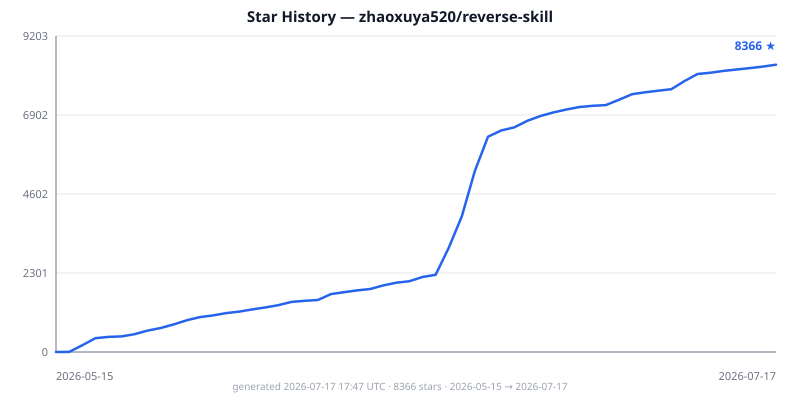

<p align="center">
  
</p>

<h1 align="center">reverse-skill</h1>
<h3 align="center">Reverse Engineering / Authorized Penetration Testing / Security Research Skill Router Pack</h3>

<p align="center"><em style="font-family: 'KaiTi', 'STKaiti', 'SimSun', serif; font-size: 1.3em; color: #999;">破暗而行，逆水为舟</em></p>

<p align="center">AI-powered routing + On-demand toolchain bootstrapping + Self-evolving knowledge base<br/>
逆向/渗透/安全技能路由包 — AI 自动路由 · 按需自举工具链 · 自动进化经验库</p>

<p align="center">
  <a href="https://github.com/zhaoxuya520/reverse-skill/releases"></a>
  <a href="https://github.com/zhaoxuya520/reverse-skill/stargazers"></a>
  <a href="https://github.com/zhaoxuya520/reverse-skill/forks"></a>
  <a href="https://github.com/zhaoxuya520/reverse-skill/issues"></a>
  <a href="LICENSE"></a>
  <a href="CHANGELOG.md"></a>
</p>

<p align="center">
  <a href="https://trendshift.io/repositories/43969?utm_source=trendshift-badge&amp;utm_medium=badge&amp;utm_campaign=badge-trendshift-43969" target="_blank" rel="noopener noreferrer"></a>
</p>

<br/>

<p align="center">
  <a href="#关于项目">关于</a> ·
  <a href="#快速开始">快速开始</a> ·
  <a href="#使用说明">使用说明</a> ·
  <a href="https://reverse.apivix.com/docs/">教学文档</a> ·
  <a href="skills/MASTER-ROUTING.md">快路径</a> ·
  <a href="skills/routing.md">路由矩阵</a> ·
  <a href="skills/ops/">作战契约</a> ·
  <a href="README_AI.md">AI 引导</a> ·
  <a href="#赞助">赞助</a> ·
  <a href="#贡献">贡献</a>
</p>

<p align="center">
  🌐 <a href="README.md">English</a> ·
  <a href="https://reverse.apivix.com/">项目官网</a> ·
  <a href="https://reverse.apivix.com/docs/">在线教学</a>
</p>

<br/>

<a id="关于项目"></a>

## 关于项目

> **如果你是 AI Agent，直接跳转到 [README_AI.md](README_AI.md)，严格按照内容要求执行。**

当 AI Agent（Claude Code、Codex、Cursor、OpenCode 或其他兼容客户端）遇到 APK、二进制、前端 JS 加密、CTF 或渗透测试任务时，这套系统能让它先路由到正确的方法论，再调用本机工具执行，而不是盲目猜命令。

```
用户任务
  → RULES.md
  → MASTER-ROUTING / master-route.ps1（PRIMARY）
  → case-init / scope.md（授权 + network_profile；未就绪禁止对目标 ACT）
  → 目标 Skill → 工具 / MCP / 脚本
  → timeline + Evidence→Finding→Path → 报告 + field-journal
```

**为什么需要这个项目：**
- AI Agent 面对 APK、ELF、JS、PCAP 不知道该用 jadx 还是 Frida 还是 IDA
- 工具路径、MCP 服务、脚本入口分散在不同机器，迁移困难
- 同样的问题每次重新踩坑，经验无法复用

### 当前状态

| 路由规则 | 回归基准 | 核心 Skill | CI 平台 | 客户端模型 |
|---:|---:|---:|---|---|
| 41 条（R0–R40） | 163 条用例 | 42 个已跟踪模块 | Windows + Ubuntu | 平台无关 |

路由核心由单一结构化配置驱动，通过跨平台 CI 验证，并与各客户端的可选适配层保持分离。

PRIMARY 快路径：[skills/MASTER-ROUTING.md](skills/MASTER-ROUTING.md) · 全表：[skills/routing.md](skills/routing.md) · 作战契约：[skills/ops/](skills/ops/)

<br/>

<div align="center">
  <a href="https://star-history.com/#zhaoxuya520/reverse-skill&Date">
    
  </a>
</div>

<br/>

<p align="right">(<a href="#关于项目">返回顶部</a>)</p>

### 技术栈

<p align="left">
  <br/>
  <code>IDA Pro</code> · <code>radare2</code> · <code>Ghidra</code>
</p>

<p align="right">(<a href="#关于项目">返回顶部</a>)</p>

<a id="快速开始"></a>

## 快速开始

### 前置依赖

- **Java / JDK** — 运行 jadx、apktool
- **Node.js 22.12+** — JS 工具链和 MCP 服务
- **Python 3.x** — Frida 和辅助脚本
- **代码 AI 客户端** — Claude Code、Codex、Cursor、OpenCode 或其他兼容客户端

### 安装

```
git clone https://github.com/zhaoxuya520/reverse-skill.git
```

### 初次使用

> **初次下载后，只需让 AI 阅读 [README_AI.md](README_AI.md)，即可按当前环境完成路由与工具检查。**

各平台详细部署文档：
- **Kali Linux** → [kali/README-kali.md](kali/README-kali.md)
- **Ubuntu/Debian** → [docs/platforms/linux.md](docs/platforms/linux.md)
- **macOS** → [docs/platforms/macos.md](docs/platforms/macos.md)

<p align="right">(<a href="#快速开始">返回顶部</a>)</p>

<a id="使用说明"></a>

## 使用说明

### 支持场景

| 场景 | 入口 |
|------|------|
| APK / Android 逆向 | `skills/apk-reverse/` |
| iOS / 移动端 | `skills/mobile-reverse/` |
| 二进制逆向 (exe/dll/so/elf) | `skills/ida-reverse/` / `skills/radare2/` |
| .NET / C# | `skills/dotnet-reverse/` |
| 前端 JS 签名 / 加密参数 | `skills/js-reverse/` |
| DSL VM / 风控自定义 VM | `skills/reverse-engineering/dsl-vm-reverse/` |
| HTTP 抓包 / 请求重放 | anything-analyzer、Reqable MCP + `js-reverse/` |
| 恶意软件 / YARA | `skills/malware-analysis/` |
| 渗透测试 / 漏洞扫描 | `skills/pentest-tools/` |
| 攻击链 / 红队编排 | `skills/attack-chain/` |
| Case 证据审查 / 报告交接 | `skills/case-review/` |
| CTF 竞赛 | `CTF-Sandbox-Orchestrator/`（42 个子技能） |
| 固件 / IoT | `skills/firmware-pentest/` |
| 补丁差分 / N-day | `skills/patch-diff-exploit/` |
| Pwn / 漏洞利用 | `skills/pwn-chain/` |
| EDR 绕过 | `skills/edr-bypass-re/` |
| API / GraphQL | `skills/api-security/` |
| 供应链 / SBOM | `skills/supply-chain-security/` |
| LLM / AI 安全 | `skills/llm-security/` |
| OLLVM 脱密 | `skills/reverse-engineering/references/ollvm-deobfuscation.md` |
| 图表 / 报告 | `skills/diagram-generator/` / `skills/docs-generator/` |

### 关键文件

| 文件 | 用途 |
|------|------|
| [README_AI.md](README_AI.md) | AI Agent 配置引导（Agent 必读） |
| [RULES.md](RULES.md) | 全局路由规则 |
| [skills/MASTER-ROUTING.md](skills/MASTER-ROUTING.md) | PRIMARY 快路径 |
| [skills/routing.md](skills/routing.md) | 路由矩阵（场景 → Skill） |
| [skills/SKILL.md](skills/SKILL.md) | 总控入口 |
| [skills/INDEX.md](skills/INDEX.md) | 自动生成的平台无关 Skill 导航索引 |
| [skills/config/routing.json](skills/config/routing.json) | 路由单一事实源（41 条规则，R0–R40） |
| [skills/tool-index.md](skills/tool-index.md) | 本机工具索引（自动生成） |
| [skills/scripts/master-route.ps1](skills/scripts/master-route.ps1) | 一键分诊 |
| [skills/scripts/case-init.ps1](skills/scripts/case-init.ps1) | 作战 case 目录（scope/timeline） |
| [skills/case-review/](skills/case-review/) | 只读 Evidence 图审查与 artifact fixity 校验 |
| [skills/scripts/test-routing.ps1](skills/scripts/test-routing.ps1) | 163 条路由回归基准 |
| [skills/scripts/verify-routing-coherence.ps1](skills/scripts/verify-routing-coherence.ps1) | 结构一致性与供应链版本固定门禁 |
| [skills/ops/](skills/ops/) | Scope / 证据链 / 角色 / 时间线 / skill 供应链安全 |
| [skills/references/community-security-skills.md](skills/references/community-security-skills.md) | 社区安全 skill 生态对照（借鉴不并库） |

### 修改后验证

```powershell
# 路由回归（163 条）
powershell -NoProfile -ExecutionPolicy Bypass -File skills/scripts/test-routing.ps1
# 结构一致性 + 供应链版本固定门禁
powershell -NoProfile -ExecutionPolicy Bypass -File skills/scripts/verify-routing-coherence.ps1
# 冒烟与 INDEX 漂移检查
powershell -NoProfile -ExecutionPolicy Bypass -File skills/scripts/smoke.ps1
powershell -NoProfile -ExecutionPolicy Bypass -File skills/scripts/extract-summaries.ps1 -Check
```

GitHub Actions 会在 Windows 与 Ubuntu 上执行同一套核心检查。

### 仓库结构

```
.
├── README.md (English) / README_zh.md / README_AI.md
├── RULES.md / RULES_zh.md     # 全局路由（含 scope 门）
├── skills/
│   ├── MASTER-ROUTING.md      # PRIMARY 快路径
│   ├── SKILL.md / routing.md  # 总控 + 三轴矩阵
│   ├── ops/                   # Scope / 证据链 / 角色 / 时间线
│   ├── scripts/               # master-route / case-init / bootstrap / verify
│   ├── field-journal/         # 脱敏经验
│   ├── apk-reverse/ mobile-reverse/ js-reverse/ dotnet-reverse/
│   ├── ida-reverse/ radare2/ reverse-engineering/ malware-analysis/
│   ├── pentest-tools/ attack-chain/ pwn-chain/ firmware-pentest/
│   ├── patch-diff-exploit/ edr-bypass-re/ binary-diff/
│   ├── api-security/ supply-chain-security/ llm-security/
│   ├── browser-automation/ diagram-generator/ docs-generator/
│   └── ...
├── CTF-Sandbox-Orchestrator/  # CTF 子技能
├── docs/                      # 平台与架构
├── kali/                      # Kali 脚本与 README-kali.md
└── work/                      # 本地 case 产物（gitignore）
```

<p align="right">(<a href="#使用说明">返回顶部</a>)</p>

<a id="赞助"></a>

## 赞助

<table>
  <tr>
    <td align="center" width="220">
      <a href="https://www.atlascloud.ai/?ref=W3Q77C">
        
      </a>
      <br />
      <a href="https://www.atlascloud.ai/oss-program">
        
      </a>
    </td>
    <td>
      <strong><a href="https://www.atlascloud.ai/?ref=W3Q77C">Atlas Cloud</a></strong> 是全模态 AI 推理平台，通过统一 API 提供 400+ 精选图像、视频、音频、3D 与语言模型。Atlas Cloud 为 reverse-skill 的跨平台路由验证、文档建设和公开安全工作流提供模型服务支持。
    </td>
  </tr>
  <tr>
    <td align="center" width="220">
      <a href="https://gokite.ai/">
        
      </a>
    </td>
    <td>
      <strong><a href="https://gokite.ai/">Kite AI</a></strong> 面向智能体经济构建身份与支付基础设施，并支持 reverse-skill 的开源维护、路由基准和平台无关安全工作流建设。
    </td>
  </tr>
</table>

<p align="right">(<a href="#赞助">返回顶部</a>)</p>

<a id="贡献"></a>

## 贡献

欢迎任何贡献！Fork 本仓库 → 创建特性分支 → 提交 PR 即可。

1. Fork 项目
2. `git checkout -b feature/AmazingFeature`
3. `git commit -m 'Add some AmazingFeature'`
4. `git push origin feature/AmazingFeature`
5. 提交 Pull Request

### 贡献者

<a href="https://github.com/zhaoxuya520/reverse-skill/graphs/contributors">
  
</a>

<p align="right">(<a href="#贡献">返回顶部</a>)</p>

<a id="许可证"></a>

## ⚖️ 许可证

本项目（`reverse-skill`）主体采用 **MIT License**（详见 [LICENSE](LICENSE)）。

**子模块与第三方依赖：**
- **CTF-Sandbox-Orchestrator/**：**GNU GPLv3**
- **Pentest Swarm AI**：原始项目为 **AGPL-3.0**，本仓库仅通过命令行/MCP 调用，不包含其源代码
- 其他工具（jadx、frida、nmap、burpsuite-mcp 等）遵循各自官方许可

<p align="right">(<a href="#许可证">返回顶部</a>)</p>

<a id="致谢"></a>

## 致谢

感谢所有开源工具和项目的作者们。本仓库集成的工具涵盖逆向工程、渗透测试、CTF、安全分析等领域，每一个工具都是社区智慧的结晶。

特别感谢 OLLVM 脱密生态的贡献者，以及所有为本仓库提供测试样本、提交 Issue 和 PR 的开发者。

<p align="right">(<a href="#致谢">返回顶部</a>)</p>

## 联系方式

- **邮箱**：[ww7517437@gmail.com](mailto:ww7517437@gmail.com)
- **QQ 群**：942400892
- **Discord**：[reverse-skill 社区](https://discord.gg/TECd3bMRR)
- **问题反馈**：[GitHub Issues](https://github.com/zhaoxuya520/reverse-skill/issues)

## 免责声明

本项目仅限用于合法的安全研究、教育、CTF 竞赛，以及对自有系统或已获得明确授权的目标进行测试。

**严禁在未经授权的情况下访问、扫描、利用、干扰目标或获取数据。** 使用者须自行确保其行为符合适用法律法规及授权范围；因滥用本项目造成的任何损失或法律责任，均由使用者自行承担，项目维护者不承担相关责任。

## 安裝與下載安全

請參閱[安裝與下載安全指引](docs/UV-AND-DOWNLOAD-SECURITY_zh.md)。
